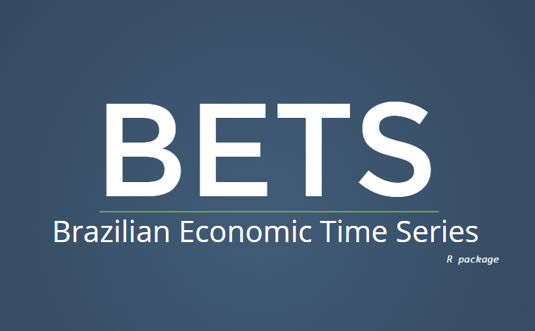

<!-- light -->

            <ul class="media-list">
              <li class="media">
                

                  

                    
                  
<!-- /.media-left-->
                  

                    <strong><h4 class = "media-heading">Model Thinking Br</h4></strong>
                    <strong>Sócio diretor</strong>
                     
                      <h5>
                         A Model Thinking Br oferece soluções econômicas e financeiras utilizando suporte estatístico, computacional e métodos de Séries
                         Temporais, buscando atender as demandas de nossos clientes de maneira ótima e fazendo com que as ferramentas desenvolvidas façam 
                         parte do dia a dia da empresa.
                      </h5>
                      
                      <h5>
                        Faz parte do nosso portfólio estudos de viabilidade, cenários macroeconômicos, previsões de curto e longo prazos, 
                        validação de modelos/algoritmos computacionais, análise de risco, desenvolvimento de indicadores etc.
                      </h5>
                      
                      <h5>
                        Atendemos empresas de médio e grande porte, fornecendo além das informações demandadas, plataformas capazes de produzir 
                        tais estudos
                      </h5>
                      <h5>
                      Somos pragmáticos e abertos a novas soluções. Começamos por definir as questões certas, para então analisá-las com rigor analítico, 
                      como base para criar soluções.
                      </h5>
                      
                      <h5>
                      Nossa equipe, formada por mestres e doutores, possui forte vínculo com a academia, buscando sempre trazer conhecimentos de fronteira para nossos clientes.
                      </h5>
                    
<!--/media body-->
                
<!--/media -->
              </li><!--/li media -->
            </ul><!--/ul media-list -->
          
<!--/jumbotron-->

 
 
 <button type="button" class="btn btn-default btn-xs">Projetos</button>

            <ul class="media-list">
              <li class="media">
                

                  

                    
                  
<!-- /.media-left-->
                  

                    <h4 class = "media-heading">Light S.A.</h4>
                    <strong>Redução do Fundo de Contingenciamento Jurídico – Pequenas causas</strong>
                     
                      
                      <h5>Foi desenvolvido um projeto que permitiu a empresa Light S.A reduzir seu fundo de contingenciamento 
                      jurídico em aproximadamente R$ 4 milhões por ano.  Basicamente, nós estimamos as principais causas de
                      contencioso jurídico da empresa e prevemos o número de processos um ano à frente, baseados nas ações
                      da empresa.</h5> 
                      
                      <h5>Para maiores detalhes veja os artigos abaixo:</h5>
                      
                      <h5><ul class="nav navbar-nav navbar-left">
                            <a href="https://github.com/pedrocostaferreira/Articles/tree/master/Conting%C3%AAncia-Judicia-na-concession%C3%A1ria-Light" target="blank">
                              <li><button class="btn btn-default" type="button"><i class="fa fa-github fa-2x" aria-hidden="true"></i> "Previsão e análise financeira da contigência..." [CITENEL, 2013]</button></li>
                            </a>
                             
                            <a href="https://github.com/pedrocostaferreira/Articles/tree/master/Conting%C3%AAncia-Judicia-na-concession%C3%A1ria-Light" target="blank">
                              <li><button class="btn btn-default" type="button"><i class="fa fa-github fa-2x" aria-hidden="true"></i> “Previsão e análise financeira da contingência...” [R. P&D Aneel]</button></li>
                            </a>
                          </ul><!-- /ul nav navbar-nav navbar-left-->
                      </h5>
                    
<!--/media body-->
                
<!--/media -->
              </li><!--/li media -->
            </ul><!--/ul media-list -->
          
<!--/jumbotron-->
          
          

            <ul class="media-list">
              <li class="media">
                

                  

                    
                  
<!-- /.media-left-->
                  

                    <h4 class = "media-heading">Agência Nacional de Energia Elétrica, ANEEL, Brasil.</h4>
                    <strong>P&D Estratégico ANEEL - Duke Energy International, Geração Paranapanema, DEI-GP, Brasil.</strong>
                     
                      
                      <h5>Consultor/Pesquisador no projeto de P&D PDE e PDDE (Sistemas Equivalentes), Modelo de Rateio do Bloco Hidráulico via Programação Não Linear e Geração de Cenários Sintéticos de Vazões e Energias</h5> 
                      
                      <h5>Para maiores detalhes veja os artigos abaixo:</h5>
                       <h5><ul class="nav navbar-nav navbar-left">
                            <a href="http://www.mddh.com.br/" target="blank">
                              <li><button class="btn btn-default" type="button"><i class="fa fa-globe fa-2x" aria-hidden="true"></i> www.mddh.com.br</button></li>
                            </a>
                          </ul><!-- /ul nav navbar-nav navbar-left-->
                      </h5>
                      
                    
<!--/media body-->
                
<!--/media -->
              </li><!--/li media -->
            </ul><!--/ul media-list -->
          
<!--/jumbotron-->

            <ul class="media-list">
              <li class="media">
                

                  

                    
                  
<!-- /.media-left-->
                  

                    <strong><h4 class = "media-heading">Consultoria Operador Nacional do Sistema (ONS) - GEVAZP e PREVIVAZM</h4></strong>
                    <strong></strong>
                     
                      <h5>
                        Consultor em Séries Temporais para a validação dos softwares de geração de cenários desenvolvido pelo CEPEL, denominados GEVAZP e PREVIVAZM.
                      </h5>
                    
<!--/media body-->
                
<!--/media -->
              </li><!--/li media -->
            </ul><!--/ul media-list -->
          
<!--/jumbotron-->
          

            <ul class="media-list">
              <li class="media">
                

                  

                    
                  
<!-- /.media-left-->
                  

                   <strong><h4 class = "media-heading">Modelos de Previsão de curto e longo prazos - DURATEX S.A.</h4></strong>
                    <strong>Professor Assistente</strong>
                     
                      <h5>Consultor para previsão mensal e anual das linhas de produtos DURATEX (louças e metais) utilizando modelos univariados e de regressão dinâmica.</h5> 
                    
<!--/media body-->
                
<!--/media -->
              </li><!--/li media -->
            </ul><!--/ul media-list -->
          
<!--/jumbotron-->
          

            <ul class="media-list">
              <li class="media">
                

                  

                    
                  
<!-- /.media-left-->
                  

                   <strong><h4 class = "media-heading">Plano Estadual de Logística e Transporte em Minas Gerais (PELT - MG) - parceria com a FIPE</h4></strong>
                    <strong>Professor Assistente</strong>
                     
                      <h5>Plano Estadual de Logística e Transporte em Minas Gerais (PELT - MG) - Fundação Instituto de Pesquisas Econômicas, FIPE, Brasil.</h5> 
                    
<!--/media body-->
                
<!--/media -->
              </li><!--/li media -->
            </ul><!--/ul media-list -->

<!--/jumbotron-->

            <ul class="media-list">
              <li class="media">
                

                  

                    
                  
<!-- /.media-left-->
                  

                    <strong><h4 class = "media-heading">Cientista chefe do centro de métodos estatísticos e computacionais (NMEC) FGV|IBRE</h4></strong>
                    
                     
                      <h5>
                         Cientista-chefe no centro de estatísticas de pesquisa da Superintendência de Estatística Públicas 
                         ( Índice de Preços e Ciclo de Negócios). Nossas tarefas são : desenvolver novas metodologias para melhorar os nossos 
                         resultados estatísticos e minimizar os custos ; proporcionar formação em Estatística Aplicada e modelos econométricos 
                         de séries temporais.
                      </h5>
                    
<!--/media body-->
                
<!--/media -->
              </li><!--/li media -->
            </ul><!--/ul media-list -->
          
<!--/jumbotron-->

 

<button type="button" class="btn btn-default btn-xs">Projetos</button>

            <ul class="media-list">
              <li class="media">
                

                  

                    
                  
<!-- /.media-left-->
                  

                    <strong><h4 class = "media-heading">Brazilian Economic Time Series (BETS) package</h4></strong>
                    <strong></strong>
                     
                      <h5>
                       O objetivo do projeto proposto pode ser dividido em dois tópicos principais: fortalecimento da pesquisa aplicada utilizando 
                       o software R (www.r-project.org) e criação de um pacote para o R com as séries temporais livres produzidas pela FGV. Tal 
                       iniciativa ajudará a inserir a FGV nas discussões da comunidade do R, software que segundo o último ranking da IEEE 
                       (IEEE 2015 Top Programming Languages) está entre os seis mais importantes do mundo e que na última avaliação subiu três 
                       posições. Tal projeto além de proporcionar maior visibilidade aos indicadores produzidos pela FGV permitirá que pesquisadores 
                       do mundo inteiro utilizem nossos indicadores diretamente no R ou façam download nos formatos dos principais softwares 
                       estatísticos\econométricos do mundo (e.g. Stata, SAS, Eviews).
                      </h5>
                    
<!--/media body-->
                
<!--/media -->
              </li><!--/li media -->
            </ul><!--/ul media-list -->
          
<!--/jumbotron-->
          
          
          

            <ul class="media-list">
              <li class="media">
                

                  

                    
                  
<!-- /.media-left-->
                  

                   <strong><h4 class = "media-heading">Estudos sobre formas de leitura e data mining de informações obtidas via webscraping, Notas Ficais Eletrônicas e scanner data e as implicações estatísticas para os índices de preços tradicionais</h4></strong>
                     
                      <h5>Numa economia de mercado, os preços dos bens e serviços podem sempre mudar. Todos os bens e serviços consumidos pelas 
                      famílias ao longo do ano são representados por um ?cesta? de artigos. Cada um dos produtos incluídos na cesta tem um preço, 
                      que pode variar com o tempo. A taxa de inflação é o preço da cesta completa num determinado mês comparado com o seu preço 
                      no mesmo mês um ano antes (ECB, 2015). Atualmente, com o avanço da tecnologia, há diversas formas de se obter informações
                      sobre preços e de se compor a cesta de um determinado índice de preço, desde que a comparabilidade entre os diferentes 
                      períodos de tempo seja respeitada. Neste contexto, este projeto estuda formas de leitura e data mining de informações 
                      obtidas via webscraping, Notas Fiscais Eletrônicas e scanner data e as implicações estatísticas para os índices de preços 
                      ?tradicionais?, principalmente os divulgados pelo FGV|IBRE. Entre os projetos em desenvolvimento destacam-se: - webscraping 
                      de preços da internet - scanner data - Leitura de Notas Fiscais Eletrônicas - Estudos Amostrais.
                      </h5> 
                    
<!--/media body-->
                
<!--/media -->
              </li><!--/li media -->
            </ul><!--/ul media-list -->
          
<!--/jumbotron-->

            <ul class="media-list">
              <li class="media">
                

                  

                    
                  
<!-- /.media-left-->
                  

                   <strong><h4 class = "media-heading">Índice Espacial de Preços ao Consumidor para o Rio de Janeiro</h4></strong>
                    <strong>Professor Assistente</strong>
                     
                      <h5>Parceria entre o Instituto Brasileiro de Economia (IBRE/FGV) e a Escola de Matemática Aplicada (FGV/EMAp). O projeto visa criar um 
                      Índice Espacial de Preços ao Consumidor (IEPC-RJ) por regiões da cidade do Rio de Janeiro.</h5> 
                    
<!--/media body-->
                
<!--/media -->
              </li><!--/li media -->
            </ul><!--/ul media-list -->

<!--/jumbotron-->

            <ul class="media-list">
              <li class="media">
                

                  

                    
                  
<!-- /.media-left-->
                  

                   <strong><h4 class = "media-heading">Aprimoramento das Sondagens Empresariais FGV|IBRE</h4></strong>
                    <strong>Professor Assistente</strong>
                     
                      <h5>Desenvolvemos ferramentas que tiveram como objetivo principal melhorar a qualidade e a produtividade das estatísticas 
                      produzidas pela Superintendência Adjunta de Ciclos Econômicos (FGV|IBRE). São elas: </h5>
                      <ul>
                      <li><strong>(a)</strong> Espelho das Sondagens Empresariais em Matlab. Todas as Sondagens Empresariais (Indústria, Comércio, Serviços e Construção) foram reprogramadas em Matlab e uma 
                      gama de exercícios e simulações foram feitas e ajudaram a definir a melhor metodologia e ponderadores (faturamento/po) para
                      as Sondagens; </li>
                      
                      <li><strong>(b)</strong> Reponderação Matricial Redistribuição dos pesos das empresas na pesquisa em caso de não resposta. Antes a 
                      redistribuição era setorial, agora é matricial. </li>
                      
                      <li><strong>(c)</strong> Backcasting Comércio. Na Sondagem do Comércio, havia uma série importante
                      que começava aproximadamente 10 meses depois. </li>
                      
                      <li><strong>(d)</strong> Desenvolvemos e repassamos a tecnologia que consiste em inverter a série, 
                      fazer uma regressão (log-log) e a partir daí fazer a previsão da série.</li>
                      
                      <li><strong>(e)</strong> Padronização das Sondagens Empresariais. Após  amplo estudo sobre a literatura das Sondagens e seguindo a recomendação da Comissão Europeia (The Joint Harmonised EU 
                      Programme of Business and Consumer Surveys - User Guide, 2007), concluiu-se que as componentes dos indicadores das sondagens 
                      deveriam ser padronizadas para terem a mesma média e desvio-padrão, para assim, permitir que as componentes fossem comparáveis e 
                      para garantir que as séries mais voláteis não dominassem o indicador final após a agregação. </li>
                      
                      <li><strong>(f)</strong> Desenvolvimento de um sistema computacional em R para fazer o ajuste sazonal: O X13-ARIMA-SEATS permitiu uma melhora na qualidade do produto final e também um aumento da produtividade dos 
                      funcionários. Por exemplo, para a sondagem do Comércio, o ajuste sazonal era aplicado em 1.472 séries. Uma equipe formada por duas pessoas 
                      gastava, em média, 4,3 minutos por série, totalizando 105,9 horas ou 14 dias de trabalho para a finalização do procedimento. Atualmente, a 
                      mesma tarefa é realizada em minutos.</li>
                       </ul>
                    
<!--/media body-->
                
<!--/media -->
              </li><!--/li media -->
            </ul><!--/ul media-list -->

<!--/jumbotron-->

            <ul class="media-list">
              <li class="media">
                

                  

                    
                  
<!-- /.media-left-->
                  

                   <strong><h4 class = "media-heading">Estudo sobre sazonalidade</h4></strong>
                   
                     
                      <h5>A sazonalidade, principal objeto de estudo deste projeto, é causada por movimentos oscilatórios de mesma periodicidade 
                      que ocorrem em período intra-anual, como variações climáticas, férias, feriados, entre outros. A ocorrência desses eventos 
                      pode levar a conclusões inadequadas a respeito da série temporal em estudo. Para a análise econômica, o importante é detectar
                      a diferença entre o que periodicamente ocorre e o que de fato ocorre de diferente naquele período específico, possibilitando 
                      observar a tendência e o ciclo da variável em análise. Dessa forma, precisa-se de uma ferramenta adequada que consiga remover
                      essa componente (a sazonalidade). Este projeto estuda os possíveis métdos de ajuste sazonal, com ênfase para o X13-ARIMA-SEATS, e os 
                      aplica em séries temporais de Business Survey, pesquisa industrial e carga de energia elétrica.
                      </h5> 
                    
<!--/media body-->
                
<!--/media -->
              </li><!--/li media -->
            </ul><!--/ul media-list -->

<!--/jumbotron-->

            <ul class="media-list">
              <li class="media">
                

                  

                    
                  
<!-- /.media-left-->
                  

                   <strong><h4 class = "media-heading">Núcleo Triplo Filtro: um medida de trajetória para a inflação</h4></strong>
                  
                     
                      <h5>As medidas de núcleo de inflação têm sido utilizadas por autoridades monetárias como ferramenta para medir a 
                      estabilização dos preços. Em países com inflação elevada, como é o caso do Brasil, no entanto, os núcleos tradicionais 
                      não parecem trazer muita informação sobre o nível geral dos preços. Mostra-se que as medidas apresentam viés, resultando 
                      na subestimação da tendência da inflação, fraca capacidade de atração e previsão da inflação (características indesejáveis 
                      segundo a literatura de núcleo da inflação). Por isso, apresenta-se uma nova medida, o núcleo triplo filtro, que filtra a 
                      inflação de três maneiras: médias aparadas, ajuste sazonal e médias móveis. Os resultados permitem dizer que o núcleo triplo 
                      filtro, além de trazer mais informação a respeito da trajetória da inflação do que os núcleos tradicionais, fornece uma visão
                      mais atual sobre o estado da inflação do que a inflação acumulada em 12 meses (medida comumente usada pelo público em geral
                      no Brasil para avaliar a trajetória da inflação).
                      </h5> 
                    
<!--/media body-->
                
<!--/media -->
              </li><!--/li media -->
            </ul><!--/ul media-list -->

<!--/jumbotron-->

            <ul class="media-list">
              <li class="media">
                

                  

                    
                  
<!-- /.media-left-->
                  

                   <strong><h4 class = "media-heading">Modelos de Previsão de curto e longo prazos da produção industrial brasileira</h4></strong>
                    
                     
                      <h5><ul class="nav navbar-nav navbar-left">
                            <a href="https://pedroferreira.shinyapps.io/timeseries/" target="blank">
                              <li><button class="btn btn-default" type="button"> <i class="fa fa-external-link" aria-hidden="true"></i><strong> Shinyapp</strong></button></li>
                            </a>
                          </ul><!-- /ul nav navbar-nav navbar-left-->
                      </h5>
                    
<!--/media body-->
                
<!--/media -->
              </li><!--/li media -->
            </ul><!--/ul media-list -->

<!--/jumbotron-->

            <ul class="media-list">
              <li class="media">
                

                  

                    
                  
<!-- /.media-left-->
                  

                   <strong><h4 class = "media-heading">Indicador de Incerteza da economia brasileira<</h4></strong>
                    
                     
                      <h5>Atualmente a incerteza econômica e política brasileira está em um nível tão elevado que políticas macroeconômicas 
                      tradicionais como a diminuição da taxa de juros e expansão fiscal terão pouco ou quase nenhum efeito sobre os investimentos,
                      o emprego e o crescimento econômico. Bloom (2013) associou a demora na recuperação da crise econômica de 2008-2009, pela
                      economia americana, com o alto grau de incerteza vivenciado no período entre 2008 e 2011. Diante dos efeitos negativos da 
                      incerteza na economia, torna-se relevante um estudo sobre o assunto no Brasil.
                      </h5> 
                      
                      <h5><ul class="nav navbar-nav navbar-left">
                            <a href="https://pedroferreira.shinyapps.io/incerteza/" target="blank">
                              <li><button class="btn btn-default" type="button"> <i class="fa fa-external-link" aria-hidden="true"></i>Shinyapp</button></li>
                            </a>
                          </ul><!-- /ul nav navbar-nav navbar-left-->
                      </h5>
                    
<!--/media body-->
                
<!--/media -->
              </li><!--/li media -->
            </ul><!--/ul media-list -->

<!--/jumbotron-->

            <ul class="media-list">
              <li class="media">
                

                  

                    
                  
<!-- /.media-left-->
                  

                   <strong><h4 class = "media-heading">Cursos in company</h4></strong>
                    <strong>Professor Assistente</strong>
                     
                      <h5>Ministrei cursos in company em Modelos de Séries Temporais, Inferência Estatística, Modelos Econométricos de Séries 
                      Temporais, Estatística Básica, R software, Séries Temporais para o setor elétrico, entre outros, para as seguintes empresas:
                      </h5> 
                        <ul>
                          <li>Petrobras S.A.</li>
                          <li>CEPEL (Centro de Pesquisas de Energia Elétrica)</li>
                          <li>Ampla Energia e Serviços S.A. (concessionária de distribuição de energia elétrica que atua no Estado do Rio de Janeiro)
                          Operador Nacional do Sistema Elétrico (ONS)</li>
                          <li>CEB (Companhia Energética de Brasília)</li>
                          <li>Universidade UNINOVE</li>
                          <li>Duke Energy International, Geração Paranapanema, DEI-GP, Brasil, entre outras. </li>
                       </ul>
                    
<!--/media body-->
                
<!--/media -->
              </li><!--/li media -->
            </ul><!--/ul media-list -->

<!--/jumbotron-->