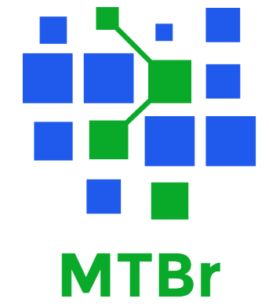

<!-- light -->

            <ul class="media-list">
              <li class="media">
                

                  

                    
                  
<!-- /.media-left-->
                  

                    <strong><h4 class = "media-heading">Model Thinking Br</h4></strong>
                    <strong>Sócio diretor</strong>
                     
                      <h5>
                         A Model Thinking Br oferece soluções econômicas e financeiras utilizando suporte estatístico, computacional e métodos de Séries
                         Temporais, buscando atender as demandas de nossos clientes de maneira ótima e fazendo com que as ferramentas desenvolvidas façam 
                         parte do dia a dia da empresa.
                      </h5>
                      
                      <h5>
                        Faz parte do nosso portfólio estudos de viabilidade, cenários macroeconômicos, previsões de curto e longo prazos, 
                        validação de modelos/algoritmos computacionais, análise de risco, desenvolvimento de indicadores etc.
                      </h5>
                      
                      <h5>
                        Atendemos empresas de médio e grande porte, fornecendo além das informações demandadas, plataformas capazes de produzir 
                        tais estudos
                      </h5>
                      <h5>
                      Somos pragmáticos e abertos a novas soluções. Começamos por definir as questões certas, para então analisá-las com rigor analítico, 
                      como base para criar soluções.
                      </h5>
                      
                      <h5>
                      Nossa equipe, formada por mestres e doutores, possui forte vínculo com a academia, buscando sempre trazer conhecimentos de fronteira para nossos clientes.
                      </h5>
                    
<!--/media body-->
                
<!--/media -->
              </li><!--/li media -->
            </ul><!--/ul media-list -->
          
<!--/jumbotron-->

 
 
 <button type="button" class="btn btn-default btn-xs">Projetos</button>

            <ul class="media-list">
              <li class="media">
                

                  

                    
                  
<!-- /.media-left-->
                  

                    <h4 class = "media-heading">Light S.A.</h4>
                    <strong>Redução do Fundo de Contingenciamento Jurídico – Pequenas causas</strong>
                     
                      
                      <h5>Foi desenvolvido um projeto que permitiu a empresa Light S.A reduzir seu fundo de contingenciamento 
                      jurídico em aproximadamente R$ 4 milhões por ano.  Basicamente, nós estimamos as principais causas de
                      contencioso jurídico da empresa e prevemos o número de processos um ano à frente, baseados nas ações
                      da empresa.</h5> 
                      
                      <h5>Para maiores detalhes veja os artigos abaixo:</h5>
                      
                      <h5><ul class="nav navbar-nav navbar-left">
                            <a href="https://github.com/pedrocostaferreira/Articles/tree/master/Conting%C3%AAncia-Judicia-na-concession%C3%A1ria-Light" target="blank">
                              <li><button class="btn btn-default" type="button"><i class="fa fa-github fa-2x" aria-hidden="true"></i> "Previsão e análise financeira da contigência..." [CITENEL, 2013]</button></li>
                            </a>
                             
                            <a href="https://github.com/pedrocostaferreira/Articles/tree/master/Conting%C3%AAncia-Judicia-na-concession%C3%A1ria-Light" target="blank">
                              <li><button class="btn btn-default" type="button"><i class="fa fa-github fa-2x" aria-hidden="true"></i> “Previsão e análise financeira da contingência...” [R. P&D Aneel]</button></li>
                            </a>
                          </ul><!-- /ul nav navbar-nav navbar-left-->
                      </h5>
                    
<!--/media body-->
                
<!--/media -->
              </li><!--/li media -->
            </ul><!--/ul media-list -->
          
<!--/jumbotron-->
          
          

            <ul class="media-list">
              <li class="media">
                

                  

                    
                  
<!-- /.media-left-->
                  

                    <h4 class = "media-heading">Agência Nacional de Energia Elétrica, ANEEL, Brasil.</h4>
                    <strong>P&D Estratégico ANEEL - Duke Energy International, Geração Paranapanema, DEI-GP, Brasil.</strong>
                     
                      
                      <h5>Consultor/Pesquisador no projeto de P&D PDE e PDDE (Sistemas Equivalentes), Modelo de Rateio do Bloco Hidráulico via Programação Não Linear e Geração de Cenários Sintéticos de Vazões e Energias</h5> 
                      
                      <h5>Para maiores detalhes veja os artigos abaixo:</h5>
                       <h5><ul class="nav navbar-nav navbar-left">
                            <a href="http://www.mddh.com.br/" target="blank">
                              <li><button class="btn btn-default" type="button"><i class="fa fa-globe fa-2x" aria-hidden="true"></i> www.mddh.com.br</button></li>
                            </a>
                          </ul><!-- /ul nav navbar-nav navbar-left-->
                      </h5>
                      
                    
<!--/media body-->
                
<!--/media -->
              </li><!--/li media -->
            </ul><!--/ul media-list -->
          
<!--/jumbotron-->

            <ul class="media-list">
              <li class="media">
                

                  

                    
                  
<!-- /.media-left-->
                  

                    <strong><h4 class = "media-heading">Consultoria Operador Nacional do Sistema (ONS) - GEVAZP e PREVIVAZM</h4></strong>
                    <strong></strong>
                     
                      <h5>
                        Consultor em Séries Temporais para a validação dos softwares de geração de cenários desenvolvido pelo CEPEL, denominados GEVAZP e PREVIVAZM.
                      </h5>
                    
<!--/media body-->
                
<!--/media -->
              </li><!--/li media -->
            </ul><!--/ul media-list -->
          
<!--/jumbotron-->
          

            <ul class="media-list">
              <li class="media">
                

                  

                    
                  
<!-- /.media-left-->
                  

                   <strong><h4 class = "media-heading">Modelos de Previsão de curto e longo prazos - DURATEX S.A.</h4></strong>
                    <strong>Professor Assistente</strong>
                     
                      <h5>Consultor para previsão mensal e anual das linhas de produtos DURATEX (louças e metais) utilizando modelos univariados e de regressão dinâmica.</h5> 
                    
<!--/media body-->
                
<!--/media -->
              </li><!--/li media -->
            </ul><!--/ul media-list -->
          
<!--/jumbotron-->
          

            <ul class="media-list">
              <li class="media">
                

                  

                    
                  
<!-- /.media-left-->
                  

                   <strong><h4 class = "media-heading">Plano Estadual de Logística e Transporte em Minas Gerais (PELT - MG) - parceria com a FIPE</h4></strong>
                    <strong>Professor Assistente</strong>
                     
                      <h5>Plano Estadual de Logística e Transporte em Minas Gerais (PELT - MG) - Fundação Instituto de Pesquisas Econômicas, FIPE, Brasil.</h5> 
                    
<!--/media body-->
                
<!--/media -->
              </li><!--/li media -->
            </ul><!--/ul media-list -->

<!--/jumbotron-->

            <ul class="media-list">
              <li class="media">
                

                  

                    
                  
<!-- /.media-left-->
                  

                   <strong><h4 class = "media-heading">Cursos in company</h4></strong>
                    <strong>Professor Assistente</strong>
                     
                      <h5>Ministrei cursos in company em Modelos de Séries Temporais, Inferência Estatística, Modelos Econométricos de Séries 
                      Temporais, Estatística Básica, R software, Séries Temporais para o setor elétrico, entre outros, para as seguintes empresas:
                      </h5> 
                        <ul>
                          <li>Petrobras S.A.</li>
                          <li>CEPEL (Centro de Pesquisas de Energia Elétrica)</li>
                          <li>Ampla Energia e Serviços S.A. (concessionária de distribuição de energia elétrica que atua no Estado do Rio de Janeiro)
                          Operador Nacional do Sistema Elétrico (ONS)</li>
                          <li>CEB (Companhia Energética de Brasília)</li>
                          <li>Universidade UNINOVE</li>
                          <li>Duke Energy International, Geração Paranapanema, DEI-GP, Brasil, entre outras. </li>
                       </ul>
                    
<!--/media body-->
                
<!--/media -->
              </li><!--/li media -->
            </ul><!--/ul media-list -->

<!--/jumbotron-->